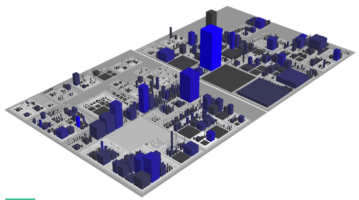
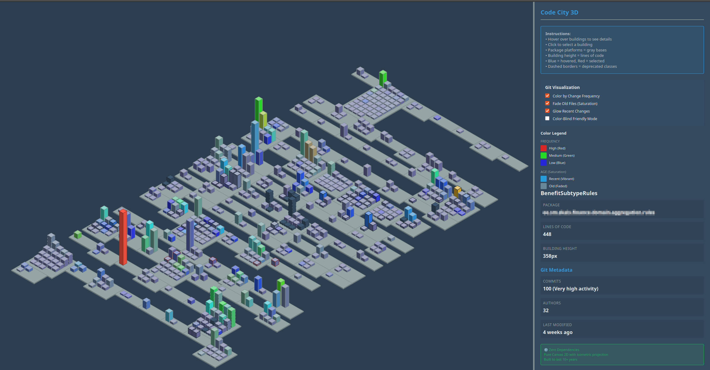

# Code City - Universal Source Code Visualizer

A simple, durable solution for visualizing any codebase as a 3D city.

## Inspiration

**Inspired by:** [CodeCity by Richard Wettel](https://wettel.github.io/index.html) - the pioneering work in code visualization as cities.

<table>
<tr>
<td width="50%">

<p align="center"><i>Original CodeCity concept by Richard Wettel</i></p>
</td>
<td width="50%">

<p align="center"><i>Our implementation with git metadata visualization</i></p>
</td>
</tr>
</table>

## Philosophy

Built to last 10+ years using only standard Unix tools and web technologies:
- **Bash script** - Works with any language, no dependencies
- **HTML/CSS/JavaScript** - Pure web standards, no frameworks
- **JSON** - Universal data format

## Quick Start

1. **Generate data from your source code:**
   ```bash
   chmod +x generate-city-data.sh

   # With git metadata (recommended if in a git repository)
   ./generate-city-data.sh /path/to/your/src output.json

   # Without git metadata
   ./generate-city-data.sh --no-git /path/to/your/src output.json
   ```

2. **Open the visualizer:**

   **Option A: Using a local web server (recommended)**
   ```bash
   # Copy output.json to the same directory as index.html
   cp output.json data.json

   # Start a simple web server
   python3 -m http.server 8000

   # Open http://localhost:8000 in your browser
   ```

   **Option B: Direct file access**
   - Open `index.html` directly in any web browser
   - Click "Choose File" and select your `output.json` file
   - The visualizer works entirely in the browser (no server needed!)

## Supported Languages

Out of the box:
- Java
- C# / .NET Core
- PHP
- Python
- Go
- TypeScript
- JavaScript

**Adding new languages:** Edit `FILE_EXTENSIONS`, `PACKAGE_PATTERNS`, and `CLASS_PATTERNS` in the script.

## How It Works

### 1. Data Generation (Bash Script)

The script:
1. Finds all source files in your project (excludes `*Test.*` files automatically)
2. Extracts package/namespace names
3. Extracts class/type names
4. Counts non-blank lines of code
5. **Extracts git metadata (if in a git repository):**
   - Number of commits per file
   - Number of unique authors per file
   - Last modified date
6. Outputs JSON in the format the visualizer expects

**Example output:**
```json
{
  "packages": [
    {
      "name": "com.example.math",
      "classes": [
        {
          "name": "Calculator",
          "linesOfCode": 150,
          "gitMetadata": {
            "commits": 45,
            "authors": 3,
            "lastModified": "2025-11-06T15:30:00+02:00"
          }
        },
        {"name": "Formula", "linesOfCode": 85}
      ]
    }
  ]
}
```

### 2. Visualization (HTML)

**Two visualizer options:**

**3D Isometric (index-3d.html)** - Recommended
- Isometric 3D projection using pure Canvas 2D
- Zero dependencies (future-proof)
- Renders packages as gray platforms
- Renders classes as 3D buildings (height = lines of code)
- Interactive hover and click selection
- Professional isometric view like CodeCity
- **Git metadata visualization:**
  - Color by change frequency (red = hotspots, blue = stable)
  - Saturation by age (faded = old, vibrant = recent)
  - Orange glow for recent changes (< 7 days)
  - Dashed borders for deprecated classes
  - Toggle controls for each metric

**2D Top-Down (index.html)** - Legacy
- Simple 2D grid layout
- Faster for very large codebases
- Good for quick overview

## Examples

### Analyze a Java project:
```bash
./generate-city-data.sh ./java-project/src city-data.json
```

### Analyze a C# project:
```bash
./generate-city-data.sh ./dotnet-project/src city-data.json
```

### Analyze multiple languages:
```bash
./generate-city-data.sh ./full-stack-project city-data.json
```

## Customization

### Change file extensions
Edit `FILE_EXTENSIONS` in the script:
```bash
FILE_EXTENSIONS="java cs php py go ts js cpp h"
```

### Include/exclude test files
By default, files matching `*Test.*` are excluded. To change this:
- **Include tests**: Remove `| grep -v 'Test\.[^/]*$'` from line 169
- **Change pattern**: Modify the grep pattern (e.g., `'Test\|Spec\.[^/]*$'` for tests and specs)

### Add comment patterns
Modify `count_lines_of_code()` to exclude your language's comment syntax.

### Adjust visualization
Edit `visualizer.js`:
- `CONFIG.locToHeightScale` - Change building height scale
- `CONFIG.buildingWidth` - Change building width
- CSS in `index.html` - Change colors, fonts, etc.

## Files

- `generate-city-data.sh` - Data generator (bash script)
- `index.html` - 2D Visualizer interface
- `visualizer.js` - 2D Rendering logic
- `index-3d.html` - **3D Isometric Visualizer** (recommended)
- `canvas-visualizer.js` - 3D Isometric rendering with Canvas
- `data.json` - Generated visualization data

## Requirements

**For data generation:**
- bash (any Unix/Linux/Mac)
- Standard Unix tools: find, grep, sed, awk, wc

**For visualization:**
- Any modern web browser (Chrome, Firefox, Safari, Edge)

## Future Enhancements

The architecture supports adding:
- More metrics (cognitive complexity, change frequency)
- Git integration (commits, authors, churn)
- Language-specific analyzers (when needed)
- 3D visualization (WebGL)
- Color coding by metrics
- Time-series animation

## Why This Approach?

**Durability:** Uses only standard tools that will exist in 10+ years
**Simplicity:** ~200 lines of readable bash, ~200 lines of vanilla JavaScript
**Universality:** Works with any programming language
**Extensibility:** Easy to add new languages and metrics
**Zero Dependencies:** No npm packages, no frameworks, no build tools

## Troubleshooting

**Script says "command not found":**
- Make script executable: `chmod +x generate-city-data.sh`

**Visualizer shows file input prompt:**
- This is normal when opening `index.html` directly (file:// protocol)
- Click "Choose File" and select your generated JSON file
- OR use a web server (see Quick Start, Option A)

**Visualizer shows "Error loading data":**
- If using a web server: Ensure JSON file is named `data.json` and in same directory as `index.html`
- Check browser console for errors
- Verify JSON is valid: `cat output.json | python -m json.tool`

**Wrong package/class names:**
- Check the patterns in `PACKAGE_PATTERNS` and `CLASS_PATTERNS`
- Your language's syntax may differ - adjust regex patterns

**Line counts seem wrong:**
- Check `count_lines_of_code()` function
- May need to adjust comment detection for your language

## License

Public domain. Use however you want.

## Contributing

This is designed to be simple enough to modify yourself. Fork it, change it, make it yours.

Key principle: Keep it simple and readable. Future maintainers (including you in 10 years) will thank you.
